# 🎮 基礎玩法遊戲篇：遊戲介面詳解

手把手從遊戲介面開始熟悉遊戲

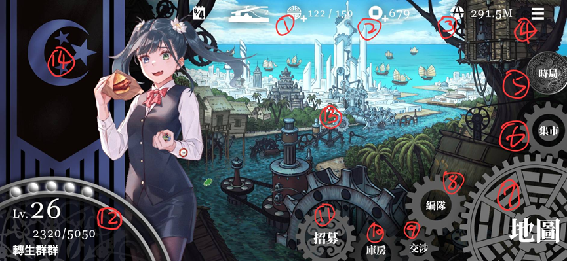

---

## 1. 體力

打據點戰、過劇情、刷符文等都會消耗體力，體力上限會隨著等級提升而跟著提升，可以透過石頭（阿爾泰之石等）快速恢復體力。

## 2. 銅錢

通過劇情、登入領取、牙牌、官職獎勵等方式獲得，可用於購買集市裡貨廊中的角色造型、庚子符文、徵才告示（抽角色）等道具，也可用於創建聯盟。**銅錢建議用來買庚子符文或後續的新符文。**

## 3. 動員力

角色等級提升、角色上限提升、符文等級提升會用到，不用特別刷，靠打據點戰（刷地）獲得就夠了。

## 4. 公告/客服/兌換碼

公告會有官方重大通知或特殊補償；客服是遇到狀況時可以詢問或課金下單的管道。

**兌換碼：**
- 皮筋兒：`Kiankok19520428`
- 用胸部思考：`bymybreasts`
- 習近平：`xijinpig8964`
- 每月一次的 DC 小狐凜禮包

---

## 5. 時局

點開有幹部、任務、排名戰、排行榜、指揮機關。

### (1) 幹部

可以依照稀有度、職業以及出身分類。稀有度分為 R、SR、SSR，通常以 SSR 為培養重點（SSR 上限 300 等）。若 SSR 等級上限太低（80 等、135 等），可以考慮練 SR（最高上限 160 等）補充隊伍空缺。

職業：間諜(綠)、游擊隊(紅)、資助者(黃)、宣傳家(藍)。

出身分為九大陣營（臺、港、蒙、藏、哈、維、滿、反、紅）以及自由勢力。

**A位**：只能放在隊伍第一個位置的角色，特徵是圖卡角落有花紋，血量特別高，承擔前排扛傷。

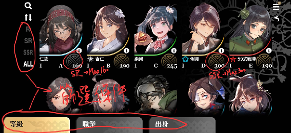

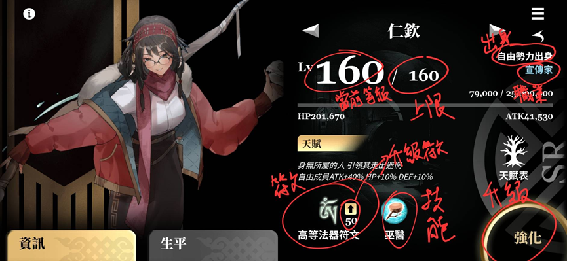

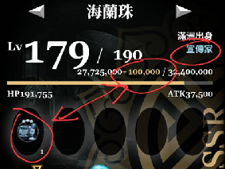

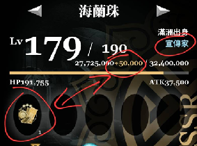

### (2) 任務

遊戲劇情，分為反共陣營與共和國陣營雙線劇情。部分關卡掉落特殊素材：

- 東沙：銅錢
- 馬尼拉：高等重擊符文
- 屯門：高等法器符文
- 赤鱲角：高等爆裂符文

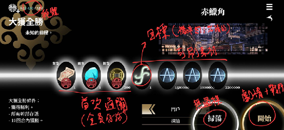

### (3) 排名戰

玩家 PVP，可以透過提升排名領取排位獎勵。隊伍配置建議單色或雙色較容易發動技能消耗。

### (4) 排行榜

各陣營排位戰名次、聯盟名次、佔領地數量多寡名次。

### (5) 指揮機關

可以看各陣營領導人、當權派聯盟、標語，以及各陣營戰略三條國策樹研發狀態（每周可增加一個），還有親的區域（例如選擇親盎格魯可以增加在盎格魯區域的戰力及援助）。

---

## 6. 集市

### (1) 票號、餉銀
課金區。

### (2) 牙牌
透過消耗體力解鎖（每消耗 100 體力解鎖一階），**只有透過劇情任務消耗的體力才算**，攻打/防守據點消耗體力不計算在內。

### (3) 貨廊
包含造型、庚子符文、徵才告示及其他課金資源，可透過存銅錢購買庚子符文（5600）。

---

## 7. 地圖

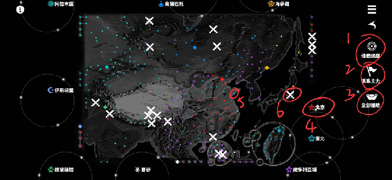

1. **任務進度**：快速定位到當前劇情進度。
2. **派系主力**：快速定位到當前聯盟主力位置；若主力所在城被其他陣營攻下，主力會回到 HQ。
3. **全部援助**：領取聯盟當下佔領的所有領土援助。
4. **HQ**：各陣營首都，出發起點，也是官職指派與領取官職獎勵的位置。
5. **城**：可看到主權及當前佔領聯盟；自己聯盟佔領的會有本地援助字樣。

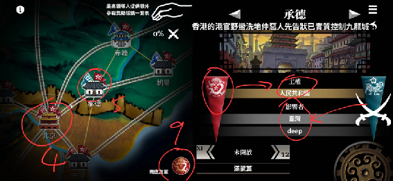

### ⚔️ 雙刀（宣戰）

當城在主力可進攻範圍內可宣戰。每場據點戰有 5 分鐘集結（最後 10 秒無法加入）+ 1 分鐘準備（選擇站位上/中/下），戰鬥為三路贏兩路獲得一勝，三戰兩勝制。三路全勝直接勝利。

### 🔋 耗體力/減戰力

依據聯盟主力與雙刀位置距離：

- 鐵路：耗 5 點體力、戰力 -5%
- 水路/土路/空路：耗 10 點體力、戰力 -50%
- 最多距離 3 格，戰力不得扣至 0

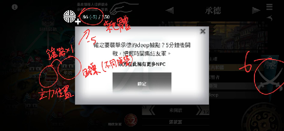

### 🚚 遷移主力

聯盟領袖/副手可遷移主力位置，依距離遠近消耗不同體力及花費不同時間。若目標在遷移完成前被佔領或主力移動則遷移失敗。

### 🤝 周遭友軍

看相同陣營的其他聯盟分布（通常用於禮拜天國戰偵查）。

### 🔍 搜尋

不知道城市位置時可利用搜尋功能找到對應城市。

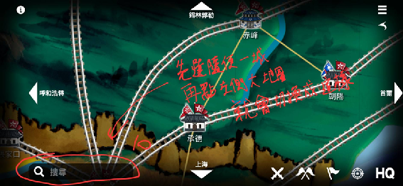

---

## 8. 編隊

可以看到當前排名戰階級、隊伍組成與等級、總戰力。

### (1) 隊伍組成

- **據點戰取向**：以高等級高戰力為目標，優先考慮能搭配庚子符文或高級符文的角色。
- **排名戰取向**：除等級外也需考量能量球分配（盡量單色/雙色）、天賦搭配。

### (2) 等級上限

- **SSR**：80 → 135 → 190 → 245 → 300
- **SR**：60 → 85 → 110 → 135 → 160

135 與 190 是 SSR 能否被選擇的分水嶺；短期內抽不到 SSR 可先練 160 等 SR。

#### 推薦 SR 角色

| 名稱 | 特色（推薦理由） | 適合場合 |
|------|----------------|---------|
| 阿勒蘇 | 可搭配爆裂高等符文，技能傷害高排位戰也可用 | 國戰排位皆可 |
| 阿勒騰別克 | 可搭配高等重擊符文，血量尚可技能尚可（A位限定） | 國戰排位皆可 |
| 仁欽 | 可搭配高級法器符文，但技能屬於輔助型排位較不吃香 | 國戰 |
| 巴特爾 | 血量高技能增加防禦，但目前沒有可搭配的高級符文（A位限定） | 排位戰 |
| 岩恩 | 天賦適合搭配游擊隊，技能發動容易，但沒有可搭配的高級符文 | 排位戰（游擊隊） |

### (3) 戰力

受角色等級及符文種類與等級影響。台灣篇 30 等就能穩定通過。

| 戰力 | 可能狀態 | 改進 |
|------|---------|------|
| <4000 | 帳號處於起步狀態，等級還在提升中，高級符文沒有湊滿 | 多刷地蒐集資源，依據現有角色職業規劃旅遊地點，蒐集大北方石頭用於刷高級符文，存銅錢買庚子符文 |
| 4000~8000 | 大多數帳號戰力數值，現有角色到達上限，已湊滿 5 高級符文甚至已有庚子符文及 300 等角色 | 等待抽到重覆 SSR 提升角色上限，繼續存銅錢買庚子符文 |
| >8000 | 邁入高戰殿堂，角色至少 2 隻 245 等或 300 等，或擁有超過 2 顆庚子 | 等待機會將角色上限突破至 300 等，慢慢湊滿整隊庚子 |

---

## 9. 交涉

### (1) 聯絡人
曾待過同聯盟的其他玩家，也可透過搜尋關鍵字/ID 尋找玩家。

### (2) 派系
沒有聯盟可加入或創建（需 100 銅幣）。已有聯盟可看同盟玩家、聊天頻道、公告。大多數玩家透過 Discord 聯絡，建議透過 DC 加入各陣營聯盟。

領袖可指派副手（最多 4 名），領袖與副手可移動主力及踢出玩家。交接只能交接給同陣營玩家。

---

## 10. 庫房

### (1) 素材
分為 3 種等級、4 種顏色。用於升級相同顏色角色經驗雙倍。

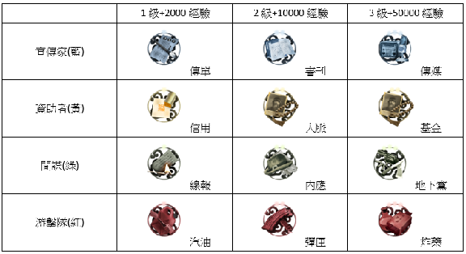

### (2) 符文
截至目前高級言靈、刀劍、暗器、弓弩、槍械符文還沒開放。特殊戰力放大 2.5 倍符文是透過特殊節日登入遊戲領取獲得，可作為沒有高等符文時的下位替代。

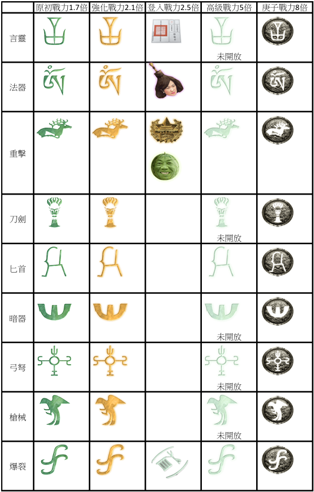

### (3) 祕笈
招募到重複角色會變成祕笈，可用於提升該角色等級上限。當該角色已抽到 5 次（上限提升到 300 等）後就可以換個卡池。

### (4) 特殊
能量石（恢復能量）、徵才告示（抽角色）、投誠泡麵（轉換陣營）。

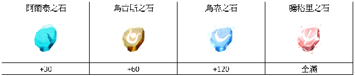

---

## 11. 招募

目前有三個抽獎池：各陣營常駐角色池、革命手記（習近平）、活動池（天安門會戰：59式戰車）。

---

## 12. 玩家資訊

包含玩家名稱、組織、帳號 ID、等級（透過通關劇情消耗體力提升等級），以及所屬聯盟。左邊角色圖像可切換成其他角色。

## 13. 背景

點擊可切換不同風格背景。

## 14. 陣營資訊

可看不同陣營當前領土總數及陣營相關資訊。切換到不同陣營時右下角有投誠選項，可利用投誠泡麵轉換陣營（紅軍陣營無法投誠）。

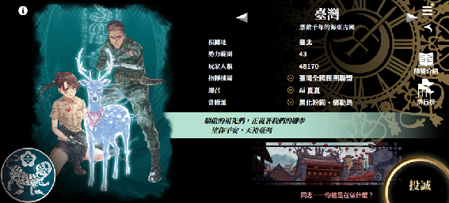
