# 🎮 基礎玩法遊戲篇：遊戲介面詳解

手把手從遊戲介面開始熟悉遊戲

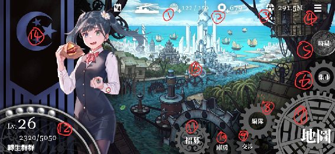

---

## 1. 體力

打據點戰、過劇情、刷符文等都會消耗體力，體力上限會隨著等級提升而跟著提升，可以透過石頭（阿爾泰之石等）快速恢復體力。

## 2. 銅錢

通過劇情、登入領取、牙牌、官職獎勵等方式獲得，可用於購買集市裡貨廊中的角色造型、符文、徵才告示（抽角色）等道具，也可用於創建聯盟。**銅錢建議全部拿去買符文**——目前貨廊販售的是保定式符文（庚子式已絕版）。

## 3. 動員力

角色等級提升、角色上限提升、符文等級提升會用到，不用特別刷，靠打據點戰（刷地）獲得就夠了。

## 4. 公告/客服/兌換碼

公告會有官方重大通知或特殊補償；客服是遇到狀況時可以詢問或課金下單的管道。

**兌換碼：**
- 皮筋兒：`Kiankok19520428`
- 用胸部思考：`bymybreasts`
- 習近平：`xijinpig8964`
- 每月一次的 DC 小狐凜禮包

> ⚠️ **上列兌換碼目前皆已失效**，保留僅供參考。可用的兌換碼請關注官方公告與 DC 每月的小狐凜禮包。
---

## 5. 時局

點開有幹部、任務、排名戰、排行榜、指揮機關。

### (1) 幹部

可以依照稀有度、職業以及出身分類。稀有度分為 R、SR、SSR，通常以 SSR 為培養重點（SSR 上限 300 等）。若 SSR 等級上限太低（80 等、135 等），可以考慮練 SR（最高上限 160 等）補充隊伍空缺。

職業：間諜(綠)、游擊隊(紅)、資助者(黃)、宣傳家(藍)。

出身分為九大陣營（臺、港、蒙、藏、哈、維、滿、反、紅）以及自由勢力。

**A位**：只能放在隊伍第一個位置的角色，特徵是圖卡角落有花紋，血量特別高，承擔前排扛傷。

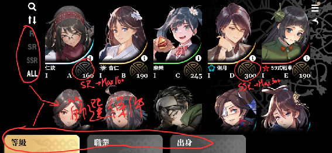

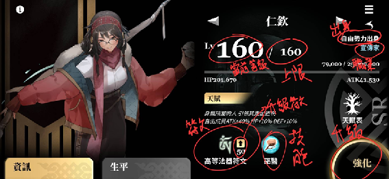

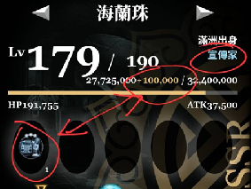

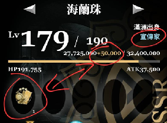

### (2) 任務

遊戲劇情，分為反共陣營與共和國陣營雙線劇情。部分關卡掉落特殊素材：

- 東沙：銅錢
- 馬尼拉：高等重擊符文
- 屯門：高等法器符文
- 赤鱲角：高等爆裂符文

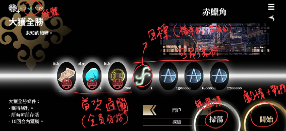

### (3) 排名戰

玩家 PVP，可以透過提升排名領取排位獎勵。隊伍配置建議單色或雙色較容易發動技能消耗。

### (4) 排行榜

各陣營排位戰名次、聯盟名次、佔領地數量多寡名次。

### (5) 指揮機關

可以看各陣營領導人、當權派聯盟、標語，以及國策研發狀態（每週可增加一個）。國策分兩類：

**綜合國策（3 條）**

| 國策 | 效果 |
|------|------|
| 戰術 | 我方據點戰戰力 **+20%** |
| 情治 | 敵方據點戰戰力 **−15%** |
| 思想 | 據點戰期間城鎮間移動時間 **−30%**、集結時間 **−30%** |

**外交國策（10 條，擇一）**

| 國策 | 我方戰力 | 敵方戰力 | 本地援助 |
|------|---------|---------|---------|
| 親大北方 | **+40%** | — | 大北方國協 +20% |
| 親婆羅多 | +30% | −10% | 婆羅多聯盟 +140% |
| 親盎格魯 | +30% | −10% | 盎格魯國協 +125% |
| 親印度支那 | +25% | −15% | 印度支那聯盟 +190% |
| 親臺灣 | +20% | −20% | 人民共和國 +20% |
| 親努山達拉 | +15% | −25% | 努山達拉聯盟 +210% |
| 親大韓 | +10% | −30% | 大韓邦聯 +260% |
| 親歐羅巴 | +10% | −30% | 歐羅巴聯盟 **+350%** |
| 親哈里發 | +10% | −30% | 哈里發聯盟 +210% |
| 親日本 | — | **−40%** | 日本皇國 +175% |

**怎麼選**：純拚戰力選**親大北方**（+40%）；壓制對手選**親日本**（−40%）；要衝資源選**親歐羅巴**（援助 +350%）。「思想」國策會縮短集結時間，**直接影響刷地時的分路緩衝**，旅遊玩家要特別注意（見進階篇）。

---

## 6. 集市

### (1) 票號、餉銀
課金區。

### (2) 牙牌
透過消耗體力解鎖（每消耗 100 體力解鎖一階），**只有透過劇情任務消耗的體力才算**，攻打/防守據點消耗體力不計算在內。

### (3) 貨廊
包含造型、符文、徵才告示及其他課金資源。**目前可購買的是保定式符文（10 倍），庚子式（8 倍）已絕版下架**——手上還有庚子的算是遺產，沒有的就直接以保定為目標。

---

## 7. 地圖

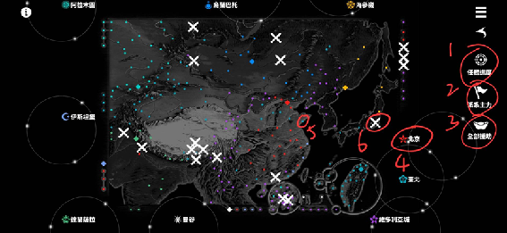

1. **任務進度**：快速定位到當前劇情進度。
2. **派系主力**：快速定位到當前聯盟主力位置；若主力所在城被其他陣營攻下，主力會回到 HQ。
3. **全部援助**：領取聯盟當下佔領的所有領土援助。
4. **HQ**：各陣營首都，出發起點，也是官職指派與領取官職獎勵的位置。
5. **城**：可看到主權及當前佔領聯盟；自己聯盟佔領的會有本地援助字樣。

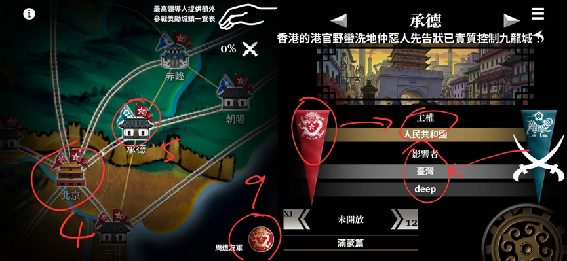

### ⚔️ 雙刀（宣戰）

當城在主力可進攻範圍內可宣戰。每場據點戰有 5 分鐘集結（最後 10 秒無法加入）+ 1 分鐘準備（選擇站位上/中/下），戰鬥為三路贏兩路獲得一勝，三戰兩勝制。三路全勝直接勝利。

### 🔋 耗體力/減戰力

依據聯盟主力與雙刀位置距離：

- 鐵路：耗 5 點體力、戰力 -5%
- 水路/土路/空路：耗 10 點體力、戰力 -50%
- 最多距離 3 格，戰力不得扣至 0

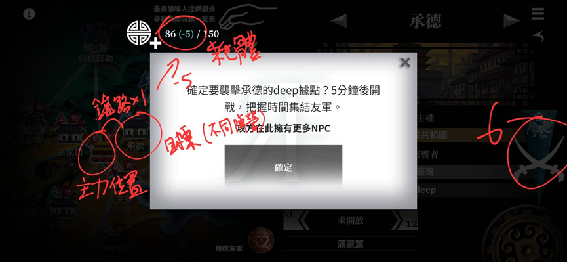

### 🚚 遷移主力

聯盟領袖/副手可遷移主力位置，依距離遠近消耗不同體力及花費不同時間。若目標在遷移完成前被佔領或主力移動則遷移失敗。

### 🤝 周遭友軍

看相同陣營的其他聯盟分布（通常用於禮拜天國戰偵查）。

### 🔍 搜尋

不知道城市位置時可利用搜尋功能找到對應城市。

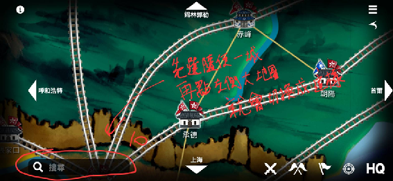

---

## 8. 編隊

可以看到當前排名戰階級、隊伍組成與等級、總戰力。

### (1) 隊伍組成

- **據點戰取向**：以高等級高戰力為目標，優先考慮能搭配保定式或高等符文的角色。
- **排名戰取向**：除等級外也需考量能量球分配（盡量單色/雙色）、天賦搭配。

### (2) 等級上限與戰力

角色等級上限、稀有度倍率、符文倍率、素材與經驗的完整說明已獨立成一章，請見 **⚡ 戰力與養成篇**。這裡只提編隊時的兩個判斷：

- **SSR 上限低於 135 等**時，戰力打不贏 160 等的 SR，先練 SR 補位。
- **符文比等級重要**。缺符文的角色就算滿等，戰力也只有裝上保定式的四分之一。

#### 推薦 SR 角色

| 名稱 | 符文屬性 | 高等階 | 特色（推薦理由） | 適合場合 |
|------|---------|:-----:|----------------|---------|
| 阿勒蘇 | 爆裂 | ✅ | 技能傷害高，排位戰也吃得開 | 國戰排位皆可 |
| 阿勒騰別克 | 重擊 | ✅ | 血量尚可技能尚可（A 位限定） | 國戰排位皆可 |
| 仁欽 | 法器 | ✅ | 技能屬輔助型，排位較不吃香 | 國戰 |
| 巴特爾 | 言靈 | ❌ | 血量高、技能增加防禦（A 位限定）；**高等階缺言靈，得直上保定** | 排位戰 |
| 岩恩 | 刀劍 | ❌ | 天賦適合搭配游擊隊、技能發動容易；**高等階缺刀劍，得直上保定或走排名戰** | 排位戰（游擊隊） |

**「高等階」欄位** 表示該屬性有沒有 5 倍的高等符文可用。打 ❌ 的兩隻養成成本明顯較高——中間沒有過渡階，只能從強化（2.1x）直接跳到保定式（10x）。
---

## 9. 交涉

### (1) 聯絡人
曾待過同聯盟的其他玩家，也可透過搜尋關鍵字/ID 尋找玩家。

### (2) 派系
沒有聯盟可加入或創建（需 100 銅幣）。已有聯盟可看同盟玩家、聊天頻道、公告。大多數玩家透過 Discord 聯絡，建議透過 DC 加入各陣營聯盟。

領袖可指派副手（最多 4 名），領袖與副手可移動主力及踢出玩家。交接只能交接給同陣營玩家。

---

## 10. 庫房

### (1) 素材
分為 3 種等級、4 種顏色（對應四職業）。升級**相同顏色**的角色時經驗雙倍。各素材的實際經驗值見 **⚡ 戰力與養成篇**。

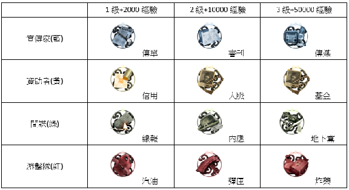

### (2) 符文
角色的戰力主要來源。目前共 9 種屬性、5 個階級（原初 1.7x → 強化 2.1x → 高等 5.0x → 庚子式 8.0x → 保定式 10.0x），另有活動限定（2.5x、9.5x）與排名戰限定（7.0x）。

**高等階目前只缺言靈、刀劍、暗器三種**，其餘六種皆已開放。完整對照表見 **⚡ 戰力與養成篇**。

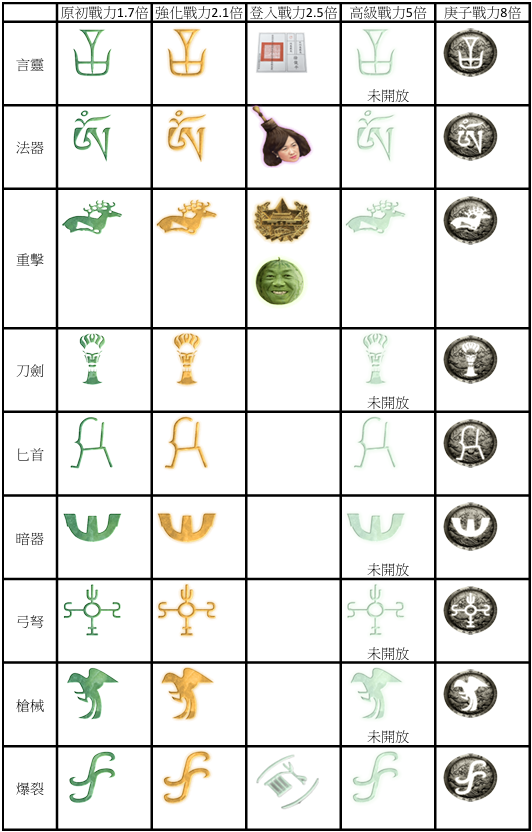

### (3) 祕笈
招募到重複角色會變成祕笈，可用於提升該角色等級上限。當該角色已抽到 5 次（上限提升到 300 等）後就可以換個卡池。

### (4) 特殊
能量石（恢復能量）、徵才告示（抽角色）、投誠泡麵（轉換陣營）。

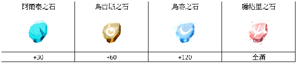

---

## 11. 招募

抽獎池分三類：**各陣營常駐角色池**、**革命手記**（特殊人物池）、**活動池**（不定期輪替）。

常駐池是穩定的養成來源；活動池限時，抽之前先確認該角色的符文屬性你是否已經有對應符文（見 **⚡ 戰力與養成篇** 的開放狀況表）。

---

## 12. 玩家資訊

包含玩家名稱、組織、帳號 ID、等級（透過通關劇情消耗體力提升等級），以及所屬聯盟。左邊角色圖像可切換成其他角色。

## 13. 背景

點擊可切換不同風格背景。

## 14. 陣營資訊

可看不同陣營當前領土總數及陣營相關資訊。切換到不同陣營時右下角有投誠選項，可利用投誠泡麵轉換陣營（紅軍陣營無法投誠）。

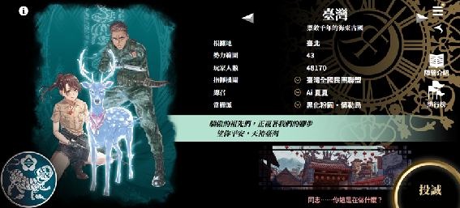
