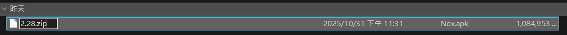
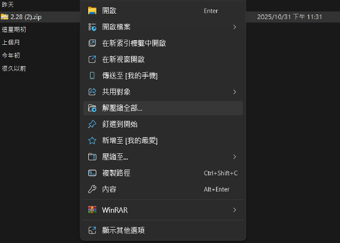
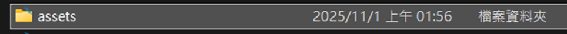
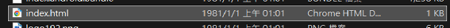
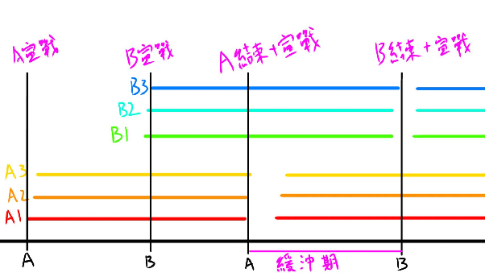
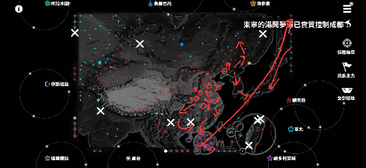
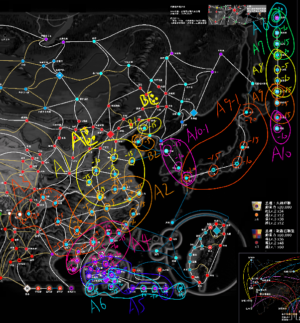

# ⚔️ 進階玩法遊戲篇

## 📱 網頁版

使用網頁版是成為高手的必經之路之一。網頁版可讓玩家自定義遊戲，最常見的應用就是同時操縱數個帳號（多開），也可以關掉音樂、跳過戰鬥畫面、預先進入戰鬥防壓秒。

### 如何獲取網頁版

1. 從逆統戰官網 [https://reversedfront.tw/](https://reversedfront.tw/) 下載 APK 檔
2. 將 APK 重新命名成 .zip
3. 解壓縮後找到 `assets` 資料夾，開啟裡面的 `index.html`

---

## 👥 多開

### 前置作業

模擬器創立新帳號，可先刷首抽再決定是否保留。

**刷首抽流程：** 公告開服獎勵 20 抽 + 劇情第一關通關獎勵 10 抽 + 聯盟排名獎勵最高 39 抽 + 其他（禮拜一登入 1 抽、人事處 1 抽），累計至少 79 抽。SSR 數量差不多 3~4 隻就可以開始認真練帳號。

**保底系統**：200 抽必出一隻 SSR（2025/11/1 起實施）。

### 多開核心思路

1. **增加戰力**：一個普通無課帳號慢慢養能發展到 4000~8000，好好練 2~3 隻帳號就跟一個滿課帳號打的有來有回。
2. **戰術多樣化**：多個帳號可以更細緻地分散戰力，留帳號觀察戰場，微操 3 路戰力分配。

### 多開小技巧

- 帳號密碼設置類似格式方便快速登入。
- 不要全部選擇同一陣營，後續需要不同陣營的車時會需要交接首領。
- **開門手**必須放在副手位置，千萬不要讓開門手當首領（帳密公開可能被惡意刪除）。

---

## 🗺️ 旅遊

### 旅遊目的

以獲取提升角色等級的素材與動員力為主，部分地區可蒐集到阿爾泰之石用於刷符文時恢復體力。

### NPC機制

| 顯示 | 攻方較多支援 | 雙方平手 | 守方較多支援 |
|------|-----------|---------|-----------|
| 狀況 | 攻方NPC比較多 | 雙方NPC戰力一樣或雙方都沒有NPC | 守方NPC比較多 |
| 戰鬥帳號 | 1 | 1 | 2~3 |

### 旅遊核心思路

1. **分頭行動**：進攻成功後主力會移動，可一次宣戰多塊地實現分路，增加刷地效率。
2. **時間控制**：同區域結束時間要接近，不同區域間保持約一分鐘緩衝期。可透過「故意輸一場」拖延時間拉開間隔。
3. **路線規劃**：根據地圖狀態決定用哪個陣營的車，觀察可用 NPC 協助快速收地的路線。
4. **預測他人動線**：觀察其他聯盟動向調整路線。

### 路線規劃實例

以紅車刷地為例（中原為台盟、東北少部分為哈薩克）：

| 輪次 | 宣戰地點 | 主力位置 | 終點 | 思路/注意事項 |
|------|---------|---------|------|------------|
| A1 | 濟南、青島、徐州、鄭州、南陽、武漢 | 北京 | 武漢 | 武漢最靠南且居中 |
| A2 | 合肥、南京、上海、杭州、溫州、福州、南昌、長沙、桂林 | 武漢 | 桂林 | 桂林居中可宣到迪慶 |
| A3 | 迪慶、木里、成都、重慶、貴陽、南寧、湛茂、廣州 | 桂林 | 廣州 | 注意迪慶是反賊（兩場） |
| A4 | 海口、三亞、梅州、廈門、潮州、深圳、元朗…大埔 | 廣州 | 大埔 | 大埔可宣到赤鱲角 |
| A5 | 沙田、屯門、荃灣、赤鱲角、葵青…九龍城 | 大埔 | 九龍城 | 可宣到倫敦及東沙 |
| A6 | 澳門、柴灣、赤柱…黃大仙 | 九龍城 | 倫敦 | 倫敦有港NPC無紅軍NPC需2帳號 |
| A7 | 華盛頓、紐約、多倫多 | 華盛頓 | 多倫多 | - |
| A8 | 卡加利、溫哥華、舊金山 | 多倫多 | 舊金山 | - |
| A9/A9-1 | 洛杉磯、奧克蘭 / 東京…福岡 | 舊金山 | 奧克蘭/福岡 | A9先宣戰再A9-1 |
| A10/A10-1 | 雪梨 / 釜山、首爾 | 奧克蘭/福岡 | 雪梨/首爾 | A10趁A9-1未結束前宣戰 |

*感謝 Keeper 台灣是台灣人的台灣提供地圖*

### 各地本地援助

**同一主權底下的所有城市，本地援助內容完全相同**——所以你不需要記 271 座城，只要記 11 個主權區塊：

| 主權 | 城數 | 本地援助內容 |
|------|:---:|------------|
| 人民共和國 | 130 | 動員力 60,000、彈匣 ×30、人脈 ×42、地下黨 ×10、傳單 ×30 |
| 大北方國協 | 49 | **阿爾泰之石 ×1**、彈匣 ×70、信用 ×48、內應 ×70 |
| 臺灣 | 20 | 動員力 20,000、傳媒 ×20、汽油 ×30、人脈 ×20、內應 ×20 |
| 婆羅多聯盟 | 14 | 動員力 24,000、炸彈 ×14、基金 ×7、地下黨 ×7 |
| 印度支那聯盟 | 10 | 動員力 30,000、炸彈 ×15、人脈 ×45、內應 ×15 |
| 盎格魯國協 | 10 | 動員力 30,000、基金 ×28、書刊 ×80、信用 ×100 |
| 哈里發聯盟 | 9 | 動員力 30,000、炸彈 ×22、彈藥 ×24 |
| 日本皇國 | 6 | 動員力 20,000、傳媒 ×30、人脈 ×100、線報 ×70 |
| 努山達拉聯盟 | 5 | 動員力 40,000、書刊 ×150、人脈 ×90 |
| 大韓邦聯 | 4 | 動員力 20,000、彈匣 ×34、書刊 ×12、基金 ×38、內應 ×12 |
| 歐羅巴聯盟 | 3 | 動員力 60,000、傳媒 ×36、書刊 ×48、傳單 ×60 |

### 怎麼看這張表

- **要阿爾泰之石就去大北方**——49 座城，而且是**唯一產石頭的區塊**。石頭用於刷符文時恢復體力，是刷高等符文的瓶頸資源。
- **要動員力就去歐羅巴或人民共和國**——歐羅巴每城 60,000 但只有 3 座；人民共和國同樣 60,000 而且有 130 座，是動員力的主要來源。
- **要高階素材（+50,000 EXP）**：人民共和國給地下黨（間諜）、盎格魯與大韓給基金（資助者）、臺灣與日本與歐羅巴給傳媒（宣傳家）。**游擊隊的炸藥不在本地援助裡**，得從別的管道拿。
- **努山達拉的書刊 ×150 是單筆最高的素材量**，只有 5 座城，宣傳家隊伍值得專程跑一趟。
- **盎格魯的信用 ×100 + 書刊 ×80** 對早期帳號很有感。

> 📊 本地援助資料來源：[逆統戰據點相關攻略（BY 東鹿 / Heuvels(岳)）](https://docs.google.com/spreadsheets/d/1jEewPShjOnRTTwc605lpH5PPR642DaIAKzKLSefSaZ8/edit?gid=1848005649#gid=1848005649)，涵蓋 263 座城。以站上的[城鎮資訊](cities.html)頁面為即時準據。

### 國策對刷地的影響

國策每週可增加一條，對旅遊的影響集中在**「思想」**這條綜合國策：

> **思想**：據點戰期間城鎮間移動時間 **−30%**、集結時間 **−30%**

集結時間從 5 分鐘縮到 3.5 分鐘，代表**分路的緩衝時間整個被壓縮**。原本抓一分鐘間隔的路線，在思想國策生效時會撞在一起，開打前務必先確認本週敵我雙方的國策狀態。

外交國策則影響你在各區域的戰力與援助收益（完整表見基礎篇 5-(5)）。刷地時若路線集中在某個區域，選對應的親 X 國策可以顯著降低翻車機率。

---

## 🏰 結算日戰鬥

> 📌 **待補充**：各陣營狀態、核心戰略位置、理論打法、實例演示。
